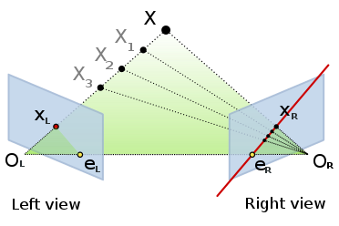
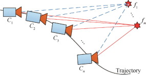
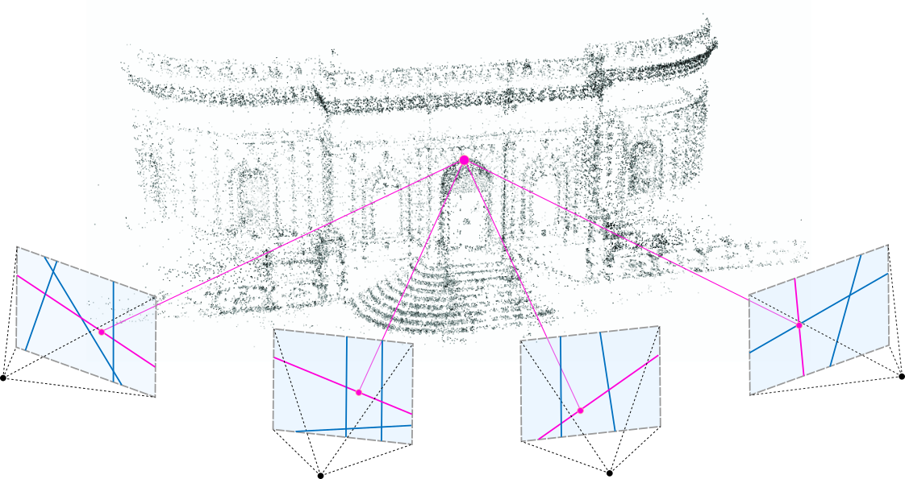

# Introduction

The problems of mapping and localisation in computer vision (or perception in general) refers to

* estimating how your camera (or any other sensor) is moving through a space (**localization**)

* while also maintaining a belief of how the outside world exists or what the structure of the world is (**mapping**). 

The problem of mapping and localisation is a bit of a chicken and egg problem. If you have a *good map*, then you can *localize*  yourself against it quite accurately. Alternatively if you *know the camera trajectory*, you can *map the environment* by triangulating features / landmarks. This problem has taken many different variants over the years and has led to widely different domains and research problems, each of which find unique and important applications in today’s commercial world.  

For example, for a Roboticist working with a robot navigating an unknown environment, building a **SLAM** (Simultaneous Localization and Mapping) system becomes critical for understanding the unknown environment. If I am a AR researcher trying to place a virtual object into the scene, a dense understanding of the scene and photo-realistic rendering is important. Hence, modern AR researchers are interested in [NERFs](https://www.matthewtancik.com/nerf) for mapping complex scenes and synthesizing novel views of scenes. Different domains are interested in solving these problems in different contexts, which will be discussed throughout the article. In addition to primary terms defined above -- localization and mapping -- we will using the term *estimation* when there is a broader need to address both localization and mapping together.

This article is the first of the two-part series on this topic. You can read the second article here.

# Key Concepts

We quickly recall the key background concepts used in this article.

- Keypoints. find unique points in the scene. These unique points become the basis of matching later on.
- Localize: find the 6-D pose in world frame. or 3-D pose (x, y, $theta$) if its a planar motion (for example, a car moving on a 2D plane or a mobile robot moving on a 2D plane)
- Epipolar geometry: Comes from a basic geometric geometric observation. Imagine two cameras observing a 3D point. The line joining the two camera centers, and the lines joining each camera center with the 3D point lies on a plane. Another way of viewing the same fact -  Imagine a ray shooting through a single pixel of a camera, and let’s assume we are somehow able to image this line in the other camera view. It can be logically concluded that irrespective of the position of the 3D point, the match for this point in the other view is constrained to lie along this imaged line in the other view.

- Essential matrix, Fundamental matrix: A mathematical system expressing the linear epipolar constraint in a matrix form. This is expresses the relationship between two corresponding points (corresponding points - two image points in two different views that arise from the same 3D geometric point). Epipolar constraint is represented as $x^{T}Ey=0$, where x and y are two corresponding image points on a  virutal camera (i.e., the intrinsics are known). The popular solution to this is the minimal solver called the “5 point algorithm”). When the intrinsics of the camera are unknown, the same constraint came be expressed as $x^{T}Fy=0$, where x and y are image point correspondences and F is the fundamental matrix. This has a “8 point algorithm”
- How is a map represented?
    - Point cloud - A set of 3D points in free space. This is the most basic and raw representation. This requires a lot of space for sometimes redundant representation. Depending on the density of point cloud, the point cloud is either sparse or dense. A sparse point cloud is useful when are just interested in relocation later on but a dense point cloud become necessary for applications that involved dense 3D understanding of the scene like placing virtual objects.
    - Meshes - A mesh is a way to represent a surface by subdividing it into a set of planar polygons, most typically, triangles.
- References
    - Some of the great go-to resources are books like [probabilistic robotics](https://docs.ufpr.br/~danielsantos/ProbabilisticRobotics.pdf) , [multiview geometry](http://www.r-5.org/files/books/computers/algo-list/image-processing/vision/Richard_Hartley_Andrew_Zisserman-Multiple_View_Geometry_in_Computer_Vision-EN.pdf) by Hartley and Zeisserman, [slam book](https://github.com/gaoxiang12/slambook-en/blob/master/slambook-en.pdf) by Tao Zhang, courses like [multiview geometry](https://www.youtube.com/playlist?list=PLTBdjV_4f-EJn6udZ34tht9EVIW7lbeo4) by Daniel Cremers, [robotics perception](https://www.coursera.org/learn/robotics-perception). For modern areas like nerfs, reading research papers is ultimately necessary to understand and keep up with state of the art. We provide additional references in each section of the article below.

# Smoothing systems / Filters
    
All measurements we make carry some level of uncertainty. Be it the images of the physical world that we see, or an estimate of robot motion through wheel odometers, the models are never perfect and our knowledge is a bit uncertain. Given that we have some level of uncertainty at some time t with some assumed / estimated uncertainty $\sigma$, how does our uncertainty increase or decrease with future measurements. Questions like these become the primary driver for modelling in smoothing systems. The most popular of these is the Kalman system. It must be noted that this kind of system can be used for both localization only (against a known map) and simultaneous localization and mapping (SLAM)

### System specifications

If it is a *localization only* system

* inputs - sensor measurements like camera images along with a known map
* outputs - instantaneous pose

If it is a *SLAM* system

* inputs - sensor measurements like camera images 
* outputs - instantaneous pose along with an estimated map

Run time / resource constraints: very fast (can run at speed as high as 30 fps) and can run on edge devices with severe memory limitations

### System description

* The estimation problem is usually simplified by a Markovian property i.e., the state at the current time stamp only relies on the state at the previous time stamp.
* The model is defined by a state vector (which a list of things we are interested in tracking), a state transition function and a measurement function

There are two equations that formalize the structure of a Kalman filtering system. Both these are assumed to be linear functions for a Kalman system. Even if we have a non-linear system, the strategy is to come up with linear approximations of the non-linear system.

- **State transition -** Describes how the system evolves through time. Given the belief of the system at t, where do we expect the system to be at time t+1? $P(x_t | x_{t-1})$. Eg: If we press the forward pedal of the accelerator of the car slowly at 10 mph for 5 seconds from a garage while keeping the steering wheels straight, we expect to move 4.4 meters forward. But the real world is not so deterministic, so we might be safer modelling this as a normal distribution with 4.4 mean and some heuristic standard deviation.
- **Measurement** - Given that we are in some belief state, what measurement do we expect to see? $P(z_t | x_{t})$ Eg: If we believed that we moved 4.4 meters out of the garage, the probability of still being in the garage are close to zero (depending on the size of the garage of course), while the probability of seeing a street road is really high.
- An abstract way to formalize state transition for a robotic system could be  $x_t = A x_{t-1} + Bu_t+\delta$, where $x_t$ is the current state, $x_{t-1}$, the previous state, $u_t$, the control signal (eg: velocity that is applied to the robot), and $\delta$, is a gaussian noise. Note that we are assuming a linear formulation for the state transition function. This could be extended to non-linear functions as well, through approximation strategies.
- An abstract way to formalize measurement for a robotic system could be $z_t = C x_t + \epsilon$, where $z_t$, is the observation at the time t and $\epsilon$, is a gaussian noise. Once again we are assuming a linear formulation for the measurement function. We can extend this to non-linear functions through approximation strategies.
- The key idea in a Kalman filter estimation can in summarized as follows: (This doesn’t follow a rigorous mathematical process, but just highlights the key ideas) The idea is to estimate the probability  $P(\tilde{x_t})$ by integrating over all, $x_{t-1}$ i.e., 
$$P( \tilde{x_t} ) = \int P( x_t | x_{t-1}) P(x_{t-1}) dx_{t-1}$$ 
The measurement function then gives you $P(z_t | \tilde{x_t})$. We can then compute $P( \tilde{x_t} | z_t )$ using bayes’ rule.

## Practical insights

* Its very hard to build detailed or dense maps with this structure but is very real time and can run on extreme resource constraints devices.
* Though this is falling out of favor with the advent of optimization based SLAM frameworks, this is still a predominant method for estimating camera movement on resource constrained edge devices like a visual odometry for quadcopters (MSCKS) or visual odometry on a phone for example
* The estimation process involves inverting an expensive co-variance matrix which is roughly $O(n^3)$, where n is the dimension of the state vector. So if we try to build detailed maps by increasing the state vector size, the computation becomes intractable.
* A fundamental limitation of Kalman filter is the Gaussian noise assumption, which may not be a realistic modelling in many cases. Lots of variants try to address this like particle filters but have a fundamental computational bottleneck.

## References

*  Andrew Davison’s pioneering work on [Real-Time Simultaneous Localisation and Mapping with a Single Camera](https://www.doc.ic.ac.uk/~ajd/Publications/davison_iccv2003.pdf) was arguably the first working modern day filtering SLAM system. 
* MSCKF - [Multi State Constraint Kalman filter](https://www-users.cse.umn.edu/~stergios/papers/ICRA07-MSCKF.pdf) is a EKF filter (Extended Kalman Filter), mostly used in drones. The state vector is the position, orientation, velocity of the system over the last K frames.
* [Probabilistic robotics](https://docs.ufpr.br/~danielsantos/ProbabilisticRobotics.pdf) is a must read for anyone wishing to gain a deeper understanding here. 

# Structure from Motion (SfM) systems 
    
If a camera captures the same scene from two different views, we can intuitively guess the relative poses of the two cameras from the captured images. Now let us imagine that we have 50 images of some unknown scene. Can we reconstruct the accurate 3D poses of the camera from these image observations? We discuss a formal mathematical framework, called Structure from Motion, to estimate this accurately.

## System specifications
* inputs - sensor measurements like camera images
* outputs - An accurate camera trajectory with a sparse map
* run time / resource constraints - mostly runs in an offline manner. Can take several minutes to estimate trajectory for 50s of frames. Can even run for days / weeks if the number of frames are increased. 

## System description

* These systems optimize for both camera trajectory and map in a globally consistent way
* There is a cost function, for a camera based system. This is usually the bundle adjustment cost, which is just the re-projection error across multiple views.
* Given some object in 3D space that is in view of a camera, where do we expect the object to appear when a photo is shot? We have an intuitive feel on how the image of the object moves around as we adjust the position of the objects in view (remember that marriage photograph where you squeezed in 150 people in a single shot). But, how do we formalize a precise mathematical system that describes where an object is exactly imaged, provided we know where the object lies in 3D space
* It is also intuitive that this function would not only depend on the relative position of the camera and the object, it should also depend on what lens we used, what camera sensor we used.

The formal answer to these problems is a pinhole camera model: 
$$x = f_xX/Z+p_x, y = f_yY / Z+p_y$$
where x and y are position of the pixel in the image that correspond to the objects, and X, Y, Z refer to the 3D position of the point in camera’s reference view, and $f_x, f_y$ are pixel focal lengths, $p_x, p_y$, describe where the principal point (origin) of the camera lies, with respect to the top left of the camera. For proof and more intuitive understanding of this, please refer to [this lecture notes.](https://web.stanford.edu/class/cs231a/course_notes/01-camera-models.pdf)

Lets say, we have another frame of reference, in which we know where the object lies and the rigid body transform $(R, t)$  that transform a point in that frame to the camera frame, Now we can rewrite the whole of our model as follows $$u = K * T * V$$  where K is the intrinsics matrix given by 
    $$\begin{bmatrix} 
    f_x & 0 & p_x \\
    0 & f_y & p_y\\
    0 & 0 & 1 \\
    \end{bmatrix}
    \quad$$
and T is the transformation is the 3x4 transformation matrix given by $$\begin{bmatrix} 
    r_{11} & r_{12} & r_{13} & t_1\\
    r_{21} & r_{22} & r_{23} & t_2 \\
    r_{31} & r_{32} & r_{33} & t_3 \\
    \end{bmatrix}
    \quad$$ and V is the homogeneous representation of the 3D point given by $$\begin{bmatrix} 
X\\
Y \\
Z\\
1\\	\end{bmatrix}
    \quad$$and u is the pixel coordinate in homogenous co-ordinates given by $$\begin{bmatrix} 
x\\
y \\
1\\	\end{bmatrix}$$

The basic intuition here is that $T * V$ transforms a point represented in some arbitrary frame of reference to camera frame of reference and $K * T * V$, computes the pixel co-ordinates of the given 3D point (in camera frame) based on pin hole camera model.

Notice that we are glossing over some details like the presence of lens distortion. Assume, for the time being, that no distortion is present.

Now we are ready to describe the *bundle adjustment (BA) cost*. Let us say we have a camera with a known transform R,t, from some global frame. If we have a point V,  we know where exactly the 3D point projects to within the sensor. Let us describe a cost function measuring the difference between the actual and expected observation $$|| u - KT V|| ^ 2$$

The above formulation is for one point in one view. Lets consider N points observed from M views, The bundle adjustment cost function can be written as follows 
$$\sum_{i=1}^M \sum_{j=1}^N || u_{ij} - K_iT_iV_j||^2$$
 The primary intuition for the above is the we have a bunch of 3D points, and we expect to see the projection of those 3D points at some estimated pixel locations in various camera views. The cost function simply measures the distance between our expected observation and real observation.

Now that we have the cost function, we can optimize the cost function for unknowns that most optimally fits the data. In the bundle adjustment, cost if we know V’s ie., the 3D point, we can estimate T’s which describes the camera position and orientation, which is called the *motion-only BA*, if we know T’s, we can estimate V’s, i.e., if we know where exactly the cameras lie, we can triangulate to find the position of certain 3D points. This is called *structure-only BA*. If we neither know T or V, it becomes a chicken and egg problem and is the crux of SLAM and SFM problems.

In SFM, though we estimate both T and V, we are not interested in estimating a dense point cloud. Our ultimate objective is to recover the camera trajectory, for which a sparse point cloud of 3D points is a by product.

When we obtain a new camera view that shares some point observations with another camera, how do we estimate the relative orientation? We can of course, optimize the bundle adjustment cost. This is a costly non-linear optimization problem. But, non-linear optimizations are only good when we have a good starting point. So getting a good starting point to iterate over is extremely important. 

In case of two-camera relative movement estimation, we have elegant linear solutions for estimating these good initial guesses for non-linear optimization. Epipolar geometry is the primary tool here -- see [Key Concepts](#key-concepts). The relative movement between two camera frames can be estimated upto scale (Essential matrix estimation), using 5 matching feature matches ( 5 point algorithm), assuming the intrinsic of the camera are known. In case of unknown intrinsic, the fundamental matrix is estimated using 8 feature point matches (8 point algorithm). This starting estimate becomes the starting point for optimizing this further when we optimize everything in the full camera cluster.

## Practical observations
1. When you have images in the wild and wish to know how the cameras taking those images were oriented, this is the system of choice.
2. Depending on the number of frames chosen, this could take a few minutes to a few days or weeks.
3. When we say a few minutes, we are talking of small scale camera trajectory estimations like camera trajectory estimation when navigating a small indoor room with 50s of frames
4. When we say days or weeks, we are talking about large scale camera trajectory estimations like city level navigation, or navigating Roman collosseum.

## References
1. [Colmap sfm](https://demuc.de/papers/schoenberger2016sfm.pdf) is a well-cited, popular and opensourced sfm system.

In the second part of this series, we will examine other techniques for localization and mapping: Multi view stereo systems, NERFs and more.

    
---
    
# References

- [https://www.researchgate.net/figure/Factor-graph-representation-of-the-Full-SLAM-problem-for-both-the-simple-example-and-the_fig3_221344652](https://www.researchgate.net/figure/Factor-graph-representation-of-the-Full-SLAM-problem-for-both-the-simple-example-and-the_fig3_221344652)
- [https://docs.opencv.org/4.x/d9/dab/tutorial_homography.html](https://docs.opencv.org/4.x/d9/dab/tutorial_homography.html)
- [https://en.wikipedia.org/wiki/Epipolar_geometry](https://en.wikipedia.org/wiki/Epipolar_geometry)
- [https://theaisummer.com/nerf/](https://theaisummer.com/nerf/)
- [https://www.researchgate.net/figure/Sparse-feature-based-3D-Reconstruction-of-KITTI-00-by-ORB-SLAM-The-top-view-shows-an_fig15_327093298](https://www.researchgate.net/figure/Sparse-feature-based-3D-Reconstruction-of-KITTI-00-by-ORB-SLAM-The-top-view-shows-an_fig15_327093298)
- [https://courses.cs.washington.edu/courses/cse455/10wi/lectures/multiview.pdf](https://courses.cs.washington.edu/courses/cse455/10wi/lectures/multiview.pdf)
- [https://cvg.ethz.ch/research/privacy-preserving-sfm/](https://cvg.ethz.ch/research/privacy-preserving-sfm/)
- [https://www.sciencedirect.com/science/article/pii/S1000936117302352](https://www.sciencedirect.com/science/article/pii/S1000936117302352)

---

