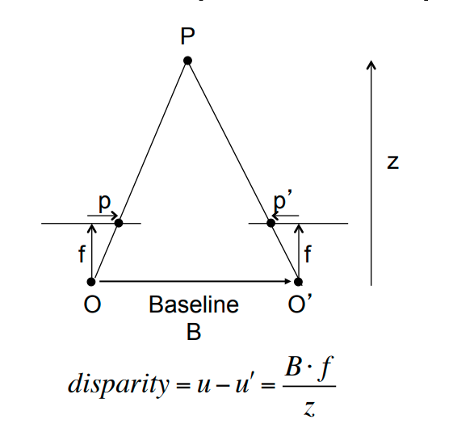
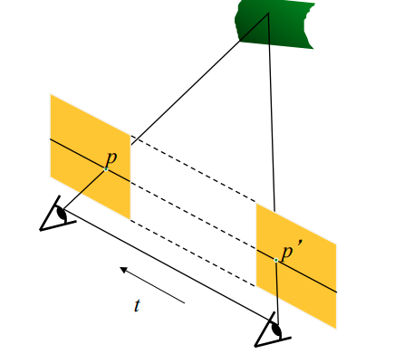
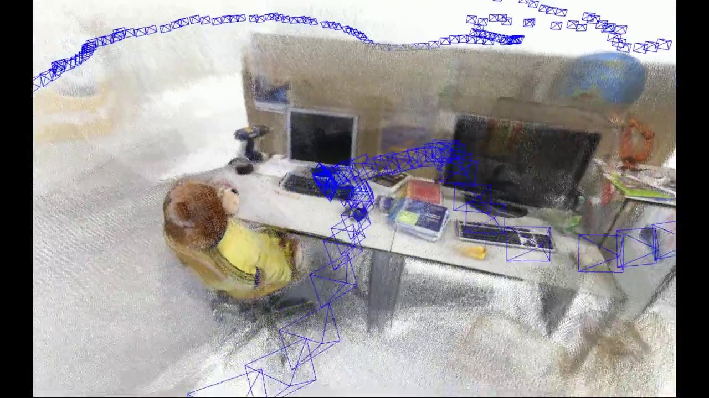
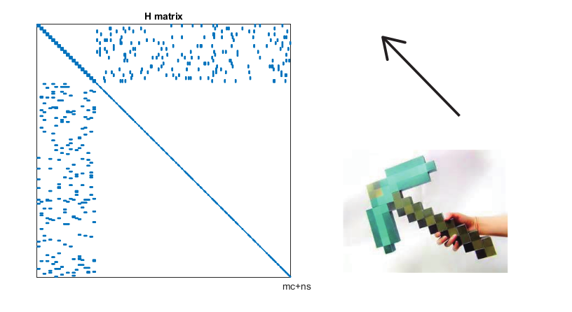
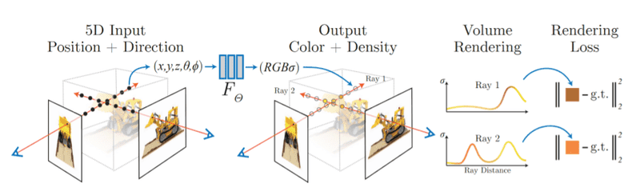

This is the second article in the series on Localization and Mapping Overview.  In the [previous article]() we discussed about smoothing and structure from motion systema. In this article, we will discuss multiview stereo system and modern optimization based SLAM systems.

## Multi view stereo system
How do we as humans infer depth of the items that we see? While there are several layers of reasoning to this, one of the primary explanations is that we have binocular stereo. The basic observation that builds up this system is that if we know two camera with known relative poses and we observe same 3D point in both camera, then the 3D point must lie at the intersection of camera rays shooting through each of those pixels. This is called triangulation and becomes the basis of setup for multiview stero systems.

.jpeg)

### System Specifications

1. inputs - sensor measurements like camera images along with their respective poses.
2. outputs - A dense map of the environment. By dense, it usually means a valid depth for almost every pixel in every image.
3. runtime / resource constraints - Lots of different approaches to this exist, based on applications. Runtimes can hugely differ from few seconds (at the expense of reduced accuracy) to few days (to achieve high accuracy). Of course, the more expensive the computation, the more accurate and more general the approach.

### System description
1. If we know the relative poses between two views, and a pair of matching points between two views, we can estimate the depth of the point through triangulation.
2. The basics of multi-view stereo come from a simple stereo setup. A simple stereo is a setup, in which there two identical camera, whose axes are aligned but are separated by a translation in X axis.
3. By simple geometry, we can conclude that  $$d = Bf/Z$$ where d is disparity, B is baseline (the distance between the two cameras) and Z is the depth of the 3D point. Here, disparity is the difference in offset of a point correspondence in two views. Let us say pixel x in image 1 and pixel y in image 2 are the image projections of the same 3D point in physical space, then $(y-x)$ is called disparity in case of the simple stereo case. A very important conclusion  this equation is that disparity is inversely proportional to depth and directly proportional to baseline.
4. But two cameras which have a random orientation do not follow the simple stereo configuration. But, once the relative pose of these two cameras are known, we can do a process called stereo rectification to bring them to the canonical simple stereo case. In the case of a stereo rectified system, the two images are changed to a different co-ordinate system so that the epipolar lines become parallel (i.e, the match for one feature point in a row is guaranteed to lie along some point along the same row in the other view). This whole process is called stereo rectification. Stereo rectification makes the problem of finding correspondence easier. Once a match is found, the disparity can be calculated, which can be used to directly estimate depth using the simple stereo formula.
5. Formative system used simple intensity based matching cost such as SAD (Sum of Absolute Difference), SSD (Sum of Squared Difference), Normalized cross correlation etc.. to find the matching point correspondence.These evaluations are pretty cheap but are not robust to find the right matches, and hence we may  end up finding wrong matches, which would result in wrong depth.Modern systems have started using deep learning to find a per pixel correspondence, which results in generating dense point map.

### Practical observations:
1. It must be noted the the stereo in this case refers to both spatial stereo or temporal stereo, as described below.
2. Examples of spatial stereo: Imagine two cameras on the extremes of a windshield of a driver assistance car. imagine a stereo rig used in motion capture in film industry.
3. Examples of temporal stereo: Imagine a mobile phone moving through space, imagine a quadcaptor with a single camera flying in the sky. In case of temporal stereo, the trjaectory / camera poses is first estimated through a structure from motion system and then a dense map is built using a mutli view stereo system.

### References:
1. [colmap-mvs](https://demuc.de/papers/schoenberger2016mvs.pdf) is a popular mvs system
2. Deep learning approaches for multi view stereo do exist like [MVS Net](https://arxiv.org/pdf/1804.02505.pdf)
        
## Modern optimization based SLAM
We have discussed in detail about SFM (structure from motion) systems. But these systems are very general, the user can feed in two random images - Two images of the same place taken from two different angles. These two camera can have any random orientation and translation. But, let us imagine a robot moving through space, the two consecutive images do not differ by a lot since a robot cannot teleport itself suddenly to a new view point. So a general structure from motion system is slow but very general and powerful. But a robot needs a real time estimate of its location and therefore, needs to be way faster. Can we use the additional knowledge we have, to construct a fast and accurate system. Ideas like these begin to build up the modern optimization based real time SLAM systems.

### System specification:
1. inputs - sensor measurements like camera images.
2. outputs - Camera trajectory estimation with sparse / dense depth map.
3. runtime / resource limitations - The front end, which estimates incremental camera motion (but can drift very quickly) is a very real time system (as high as 15 - 30 fps), but the backend, which runs in a different thread runs a sfm-like bundle adjustment, which can take several seconds to several minutes depending on the length of the trajectory. But, the end objective is to have a most upto date map of the environment along with the camera pose, at a maximum response rate bottlenecked by computational resources.
### System description:-
1. SFM and MVS systems discussed above are never real time. They are more about offline processing (Read [“building rome in a day”](https://grail.cs.washington.edu/rome/rome_paper.pdf)).
2. For real time applications, we need a real time system that builds a map and localizes the camera as well in realtime.
3. SLAM often involves meaningful engineering trade offs to make things real time (Example: Should the bundle adjustment happen over the entire sequence of frames, or is it good enough to perform bundle adjustment over N representative frames (key frames), or can we do it over the last N frames (windowed bundled adjustment)).
4. SLAM is as much about engineering ingenuity as it is about research ingenuity. Example: Organize mapping and localisation into two separate threads that run parallel (Read [PTAM](https://www.robots.ox.ac.uk/~gk/publications/KleinMurray2007ISMAR.pdf)). The front end odometry estimation responds in real time to give a real time localisation estimate while the back end optimizes for a more accurate localisation and mapping by optimizing a more expensive bundle adjustment.
5. The notion of incremental solving becomes important in SLAM. We may have seen 50 frames and have an optimal pose and map estimate in some const function sense over these 50 frames. Given that we observed a new frames, how do we adjust our previous belief? Not all of the previous estimates need to recomputed, how do we know what subset of frames are affected by the current observation? The answer to questions like these are answered by [incremental smoothing and mapping](https://www.cs.cmu.edu/~kaess/pub/Kaess08tro.pdf) (i-sam)
6. The typical linear system being solved at the crux of the SLAM problem can be represented as $$\begin{bmatrix} 
        	B & E \\
        	E^T & C
\end{bmatrix}
\begin{bmatrix} 
        	\Delta x_c \\
        	\Delta x_p
\end{bmatrix} = \begin{bmatrix} 
        	v \\
        	w
        	\end{bmatrix}$$
Notice that the co-efficient matrix has been specifically structured to reflect the fact that it is symmetric. We discussed the bundle adjustment cost function in our structure from motion section as 
			
$$\sum_{i=1}^M \sum_{j=1}^N || u_{ij} - K_iT_iV_j||^2$$
			
Let us simplify notation and write the same function as follows  $$\frac{1}{2}\sum_{i=1}^M \sum_{j=1}^N f(x)^Tf(x)$$, where 
			$$f(x)= u_{ij} - K_iT_iV_j$$
			
and x represents all the inputs to the function like u, T, K, and V, and the constant $\frac{1}{2}$ scales the value of the function but doesn’t change the maxima and minima. Let us approximate the value of the function $f$, $\Delta x$ away from x, as $$f(x_0+\Delta x) = f(x_0) + J^T \Delta x$$ (from Taylor’s series expansion upto first order). Approximating $f$ by its Taylor’s series upto first order, taking it is first derivative and equating it to zero, gives the optimal value of $\Delta x$, that minimizes the cost function (the second order derivative test would prove that the stationary point is indeed a minima). This leads us to the final system of equations  $$J(x) J(x)^T \Delta x = -J(x) f(x)$$

 Note that the co-efficient matrix on the right is symmetric. This is a short discussion illustrating how the matrix system we showed above is derived and the standard Gauss Newton solving techinique.

7. A visualization of these linear system shown above would hugely show something insightful.

8. The structure of the coefficient matrix is like an arrow, which makes it clear that this matrix is not dense. Notice the sparsity pattern along the diagonal. This can be understood intuitively by looking at a graphical view of the whole system.
.png)
9. We can see that each camera pose is only related to a few neighboring camera poses by virtue of observing a few points that some of these neighboring camera poses observed, so the unknown position of one camera is only related to a few neighboring pose unknowns and a few map point unknown that it observes. This is what the sparsity in this linear system is all about. The heart of SLAM research is about how do we exploit this sparsity to solve the SLAM problem efficiently. Lots of frameworks exist to solve the Non-linear Least Squares Minimization problem (bundle adjustment) like Ceres. But the graph structure of SLAM lends its way to graph based solvers like g20, GTSAM, Factor graphs etc.., which end up exploiting this sparsity better.

### Practical observations
1. This is an active research area and many different variants and subtleties exist in the combinatoric research space.
2. Depending on nature of maps.
    - Dense - if we are interested in generating a very dense point cloud.
	- Sparse - if we are interested in tracking a few 3D point to help us localize later.
3. Cost function optimized.
    - Geometric methods optimize the geometric bundle adjustment.
    - Direct methods optimize photo metric bundle adjustment.
3. Sensors involved.
    - Any combination of sensors involving cameras, Lidar, IMUs, sonars.
### References
1. [The SLAM book](https://github.com/gaoxiang12/slambook-en) by Tao Zhang is a must read, if someone wishes to understand this area.
2. [ORB SLAM](https://arxiv.org/pdf/1502.00956.pdf) is a well known and well cited SLAM system.
3. [Kimera](https://arxiv.org/pdf/1910.02490.pdf) is a great framework that encompases many key research ideas to create an overarching SLAM framework.

## Neural Radiance Fields (NERF)
We haven't highlighted the photo realism of reconstruction systems so far. Our whole focus has been on geometry, we never bothered about photometry. If we were to predict what image would we get from a novel view point, we would get not-so-realistic, cartoonish renderings for novel view points. This is not ideal for applications like Augmented Reality where the user has to have an immersive experience. The idea of Neural Radiance Fields (NERFs) helps address this problem.

    
### System specification
1. System input - sensor measurements like camera along with their corresponding poses. Most NERF methods cannot estimate the camera poses -- one way to obtain them is through SfM or SLAM.
2. System output - a dense photorealistic map of the environment that can be seen by rendering from different novel view points.
3. runtime / resource constratints - Can run several hours to several days on a GPU for a single scene. Speeding things up is an active area of research.

### System description
1. Notice how we paid very little attention to the photometry of the points in all the previous approaches and the discussion was primarily around the geometry of the points.
2. While point clouds do get assigned colors or textures, there isn’t a globaly consistent way to do. We may assign a point a certain color based on what color that point was observed with in a given camera view, but the color will change if the same point is viewed from other views. The color of point changes with view since the point radiates different amount of light in different directions. This can vary based on the physics of the object like material properties, reflectance etc..
3. Due to this, rendering of point clouds / meshes from previous systems usually look a bit cartoonish since it is a view point independent rendering.
4. To get view point dependent rendering, the notion of a plenoptic function becomes useful. Rather than modelling the color from a point as a function of 3D position alone, this function models the color as 5D function (geometric position of the point (3D) + viewing direction (2D)) i.e., $$F_\theta:(x,d)->(c, \sigma)$$
 where F is a function parameterized by learnable weights $\theta$, x is the 3D position of an arbitrary point and d is the 2D viewing direction, c is the radiance (color) of the given point and $\sigma$ is the density of the point (density is a measure of how opaque a point is).
5. The problem setup of a NERF is defined as follows - given a set of known camera poses and their corresponding images, learn a plenoptic function that can be utilized to render a scene from any viewing angle in a photo realistic sense (view point dependent rendering).
6. How is a pleonoptic function built? This is an active area of research. But the first NERF paper started by modelling this as a MLP (Multi layer perceptron), that given a 5D input (3D position and 2D view angle), produces a radiance value (color) and density value ( how much each point is contributing to the final rendering in the given view - remember some points could be occluded by other points in a given view. We could also have transparent 3D point like freespace points, which may not contribute too much to the final rendering).
7. How is an image rendered on a novel view point? Do raycasting on all pixels on the novel image view. Sample points according to some hueristic along the ray. The final value of pixel in a novel view, is the integration of radiance values across many samples along the ray weighting by their density values. This is just a synthesized brief explanation. Refer to the original paper, [“NeRF: Representing Scenes as Neural Radiance Fields for View Synthesis”,](https://arxiv.org/pdf/2003.08934.pdf) to understand this in a more rigorous way).

8. The color value of a pixel at a given image (camera pose) is given by $$C(r) = \int_{tn}^{tf}T(r(t))\sigma(r(t))F(r(t), d) dt$$
 where $r(t)$ is a ray originating at a given pixel in the pin hole camera model,  $\sigma$ is the density value, $F$ is the plenoptic function giving out the radiance value (that takes in both the 3D position of the point and its viewing direction as input) and $T$ is the transmittance value - the probability that this 3D point is seen without being occluded by another object in scene. The value of transmittance is given by $$T(r(t)) = e^{-\int_{tn} ^{t}\sigma(s) ds}$$.

9. If these equations seem too complex, here is a primary intuition, imagine a ray shooting through a pixel into 3D space. As the ray moves farther and farther away, the probability that each successive point contributes to the meaningful radiance of that pixel should be a monotonically decreasing function. For example, if there an obstacle in the way of the point, the points close by the surface of the point would contribute most of the radiance, where points beyond the obstacle will not contribute anything meaningful to this ray. This is essentially captured by the transmittance T. Though the ability of each point to propagate its radiance to a certain pixel depends on the probability given by the overall transmittance of the ray until this point, the amount of contribution from each point also depends on how opaque a given point is. Thus the overall integration for $C(r)$ is an accumulation of values from plenoptic function at each point along the ray, weighted by it is opaqueness (density $\sigma$) multiplied by  the probability that this value will be transmitted to the pixel (Transmittance T).
10. Of course, the equation show above is a continuous version. The only way to compute it in a tractable way is to  take samples along a ray and find a discrete approximation to the continuous integral.

### Practical insights
1. Image rendering on a novel view point is NOT realtime. It can takes a few minutes to even few hours to render a novel view. Appreciate the cost involved. Let us consider an image with M X N pixels (480 x 640 for example). We have to shoot a ray through each pixel and sample points along the ray. For each sample along the ray, we have to evaluate a bulky MLP model, which means that we have to do a few million inferences to get the final rendering for a single image. For a continuous camera motion  that we often encounter in NERF papers, we have to render several hundreds of frames to create a smooth video).
2. Training the MLP is not cheap either. It sometimes takes weeks / days to train a MLP for a single scene. 
3. A hot area of research is to speed up NERF training and inference. Some research directions include using regularizers in the cost function, using basis functions with attractive mathematical properties to speed up training and so on.

### References
1. NERF research is exploding. [Frank Dellart’s blog on NERFs](https://dellaert.github.io/NeRF22/) is a good summary to jump start on latest NERF research and pick up some state of the art methods to read.

## AI in mapping and reconstruction
We did not discuss the applications of AI in localization and mapping (except NERFs ofcourse). Though classical methods are firmly entrenched in lot of these frameworks, deep learning is certainly showing promise and encroaching a lot of areas within the classical framework. Here are some of the promising directions, in which deep learning based approaches will likely take over classical methods in the coming years.
1. End to end networks have been tried out for relative pose estimation (See [PoseNet](https://arxiv.org/pdf/1505.07427.pdf)), but these have not proven to as effective as classical methods
2. Networks exist for all aspects of feature matching process.
        1. Feature extraction - Deep learnt features like Super point.
        2. Feature matching - networks for matching like Super glue.
        3. End to end feature matching using Graph Neural networks.
3. Learning right representations for 3D structure using networks (like code SLAM).
4. End to end full camera motion estimation systems like Deep Visual Odometry. 
5. SLAM’s dependence on classical computer vision is a fundamental bottleneck to the robustness of algorithms. So, given the promise that AI is showing, some of the modules (especially steps like feature extraction and matching) will be eventually replaced by learnt methods.

### References
1. [Superpoint](https://arxiv.org/pdf/1712.07629.pdf) and [Superglue](https://arxiv.org/pdf/1911.11763.pdf) are deep learning based feature detection / feature matching frameworks respectively.
2. [PoseNet](https://www.cv-foundation.org/openaccess/content_iccv_2015/papers/Kendall_PoseNet_A_Convolutional_ICCV_2015_paper.pdf) was one of the first attempts at learning to estimate camera pose in a network end-to-end, but the research in the area has not quite caught upto the accuracy of classical vision methods.
3. Lots of modern works for direct matching of pixel without detecting and computing key points like [LOFTR](https://arxiv.org/pdf/2104.00680.pdf) do exist and is a hot area of research.

# Comparison of different methods via use cases

Given the large variety of methods for 3D reconstruction, one may ask the question: *Under what scenarios do I use a particular method ?* We answer the question by comparing the techniques discussed earlier under different use cases.

| Use case | Camera Pose available/estimated | Output: Pose needed? Real time / offline | Output: Map needed? | Output: Photo realism needed? | Solution |
| --- | --- | --- | --- | --- | --- |
| A mobile robot is navigating an unknown terrain. You wish to know in real time where the robot is. under Tight resource constraints | No | Yes (Realtime) | A sparse Map for relocalising | No | A filter based SLAM like MSCKS |
| A mobile robot is navigating an unknown terrain. You wish to know where the robot is. Resource availability is a little more generous | No | Yes (Realtime) | Dense map is needed | No | Optimization based SLAM. the front end visual odometry provides real time localization, while the backend optimizes to avoid long term drift. |
| You have taken a few images in the wild and wish to know how the 3D structure looks. You can process them offline. | No | No (offline) | Yes | No | Run sfm, followed by MVS |
| You have taken a few images in the wild and wish to have photo realistic rendering of the scene from multiple views (like for AR). You can process them offline. | No | No (offline) | Yes | Yes | Run SFM, followed by a NERF |
    
## References
1. [https://www.researchgate.net/figure/Factor-graph-representation-of-the-Full-SLAM-problem-for-both-the-simple-example-and-the_fig3_221344652](https://www.researchgate.net/figure/Factor-graph-representation-of-the-Full-SLAM-problem-for-both-the-simple-example-and-the_fig3_221344652)
2. [https://docs.opencv.org/4.x/d9/dab/tutorial_homography.html](https://docs.opencv.org/4.x/d9/dab/tutorial_homography.html)
3. [https://en.wikipedia.org/wiki/Epipolar_geometry](https://en.wikipedia.org/wiki/Epipolar_geometry)
4. [https://theaisummer.com/nerf/](https://theaisummer.com/nerf/)
5. [https://www.researchgate.net/figure/Sparse-feature-based-3D-Reconstruction-of-KITTI-00-by-ORB-SLAM-The-top-view-shows-an_fig15_327093298](https://www.researchgate.net/figure/Sparse-feature-based-3D-Reconstruction-of-KITTI-00-by-ORB-SLAM-The-top-view-shows-an_fig15_327093298)
6. [https://courses.cs.washington.edu/courses/cse455/10wi/lectures/multiview.pdf](https://courses.cs.washington.edu/courses/cse455/10wi/lectures/multiview.pdf)
7. [https://cvg.ethz.ch/research/privacy-preserving-sfm/](https://cvg.ethz.ch/research/privacy-preserving-sfm/)
8. [https://www.sciencedirect.com/science/article/pii/S1000936117302352](https://www.sciencedirect.com/science/article/pii/S1000936117302352)
